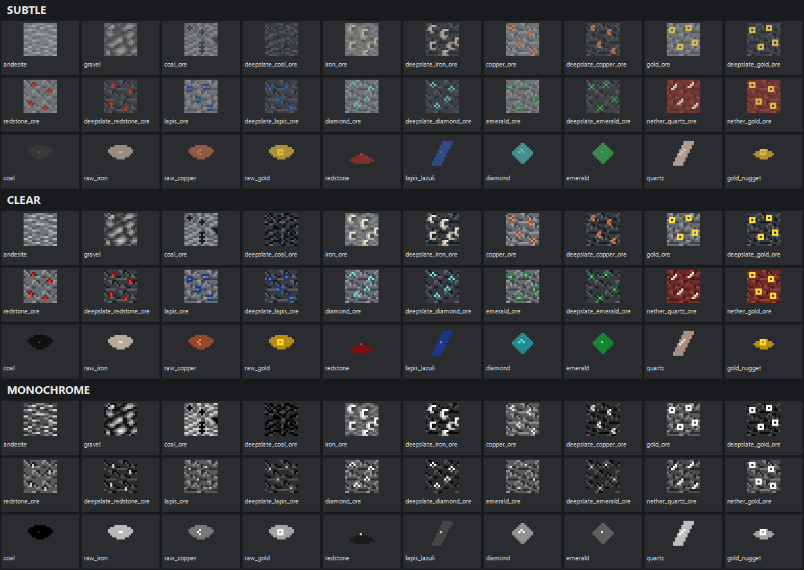

# Changelog

## 0.6.0 - Release readiness

- Updated the public author identity and project links from ID7ZH to KohakuD.
- Added structured GitHub forms for bug reports and accessibility feedback.
- Licensed source code under MIT and original DistinctCraft visual assets under CC BY 4.0, with explicit Minecraft and third-party exclusions.
- Added an original, editable SVG brand symbol plus optimized NeoForge and CurseForge PNG exports.
- Added automated release validation for identity, licensing, support files, branding, and packaged metadata.

## 0.5.0 - Compatibility and future extensions

- Pinned reproducible, mutually exclusive development tests for Jade 26.2.10 and WTHIT 20.0.0.
- Added verified Modrinth downloads, compatibility-log checks, and a manual overlay smoke-test checklist.
- Confirmed that no Jade- or WTHIT-specific runtime integration is needed for vanilla block identity.
- Verified correct target-player overlay behavior with both Jade and WTHIT; Jade also reports the expected harvesting tools in Survival mode.
- Preserved the selected DistinctCraft pack position when switching profiles and documented how overlapping third-party packs are prioritized.
- Documented a staged, optional path for future modded-block add-ons and strict no-X-ray boundaries for any later visible-surface light accent.
- Deliberately deferred emissive ore accents: 0.5.0 remains texture-only unless later in-game testing demonstrates a real readability need.

## 0.4.0 - Coverage expansion

- Added accessible textures for all stone and deepslate variants of coal, iron, copper, gold, redstone, lapis, diamond, and emerald ore.
- Added Nether quartz and Nether gold ore textures.
- Added matching inventory textures for the ten primary ore drops.
- Extended Subtle, Clear, and Monochrome with the same shape language across world and inventory textures.
- Added registry-aware asset validation and an expanded three-block-high smoke-test wall.
- Confirmed that all changes are static surface textures without emissive layers, world scanning, or through-wall rendering.

## 0.3.0 - UX, controls, and feedback

- Added the client settings screen, profile-cycle key, and optional high-contrast target outline.
- Removed the experimental second crosshair marker after playtesting.

## 0.2.0 - Profile system

- Added the Subtle, Clear, and Monochrome bundled resource-pack profiles.
