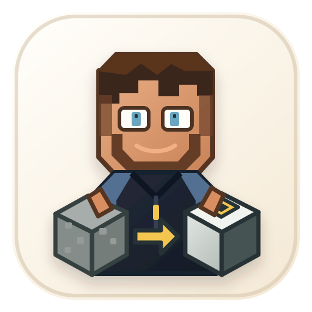

# DistinctCraft



DistinctCraft makes Minecraft blocks and ores easier to distinguish through accessible textures, clear patterns, and stronger contrast. Designed especially for players with color vision deficiencies.

## Technical foundation

- Minecraft 26.2
- NeoForge 26.2.0.75
- Java 25
- Mod ID: `distinctcraft`
- Client-side only

## Development

```powershell
.\gradlew.bat build
.\gradlew.bat runClient
```

## Accessibility profiles and controls

Version 0.6.0 includes the built-in `clear`, `subtle`, and `monochrome` profiles, an in-game accessibility screen, quick profile switching, optional target feedback, all standard Overworld ore variants, Nether quartz and gold, and matching primary drops. Jade and WTHIT are supported as optional, mutually exclusive overlay mods for compatibility testing; Jade is the preferred local test provider. See [docs/Profiles.md](docs/Profiles.md), [docs/Accessibility.md](docs/Accessibility.md), [docs/No-Xray.md](docs/No-Xray.md), [docs/Future-Extensions.md](docs/Future-Extensions.md), and [docs/testing/0.5.0-compatibility.md](docs/testing/0.5.0-compatibility.md).

## License

Source code is licensed under MIT; original DistinctCraft visual assets are licensed under CC BY 4.0. See [LICENSE](LICENSE) for scope and attribution details.

## Feedback and support

Use [GitHub Issues](https://github.com/KohakuD/MCDistinctCraft/issues) for reproducible bugs and accessibility feedback. Please see [SUPPORT.md](SUPPORT.md) before attaching logs or screenshots.

## Unofficial project notice

DistinctCraft is not an official Minecraft product and is not approved by or associated with Mojang Studios or Microsoft. See [NOTICE.md](NOTICE.md).
